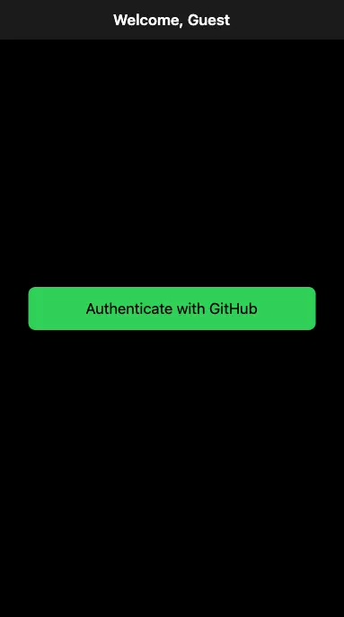
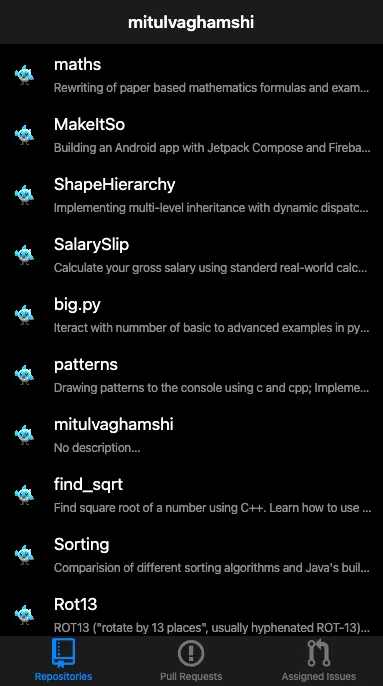
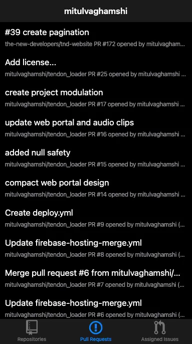
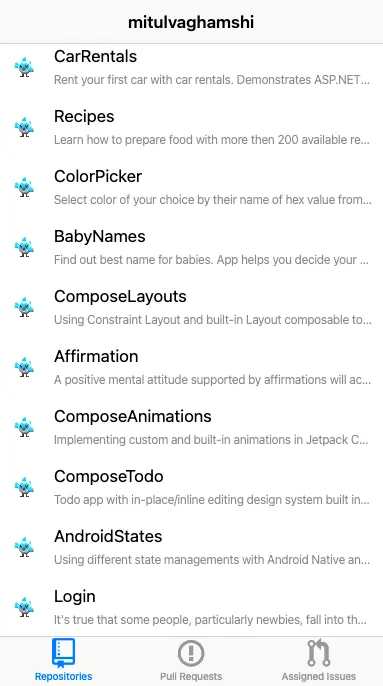

# GitHub Client with Content Caching

Flutter desktop app that accesses GitHub APIs to retrieve your repositories,
assigned issues, and pull requests. In accomplishing this task, you'll create
and use plugins to interact with native APIs and desktop applications, and use
code generation to build type safe client libraries for GitHub's APIs.
[Source][source]

Checkout original google codelab
[Write a Flutter desktop application][codelab] written by brettmorgan.

## Preview






## How to run the app

- To run the app, you need a **OAuth2** app registered with GitHub.
- This app requires `repo` and `read:org` scopes enabled on your **OAuth2** app.
- Don't forget to copy your client secret, as it only visible once at the time
  of app creation.
- Once setup complete, create a `config.json` file on the project root:

```console
github_client/config.json
```

- Obtain your **Client ID** and **Client Secret** from above registered app, and add it
  to the `config.json` file as:

```json
{
  "CLIENT_ID": "your-client-id",
  "CLIENT_SECRET": "your-client-secret"
}
```

- **Important Note:** Do not commit `config.json` to your version control system.
- Finally run the app as:

```console
flutter run --dart-define-from-file=<path-to-config-file>

## Example
flutter run --dart-define-from-file=config.json
```

[source]: https://codelabs.developers.google.com/codelabs/flutter-github-client#0:~:text=Flutter%20desktop%20app,for%20GitHub%27s%20APIs.
[codelab]: https://codelabs.developers.google.com/codelabs/flutter-github-client
