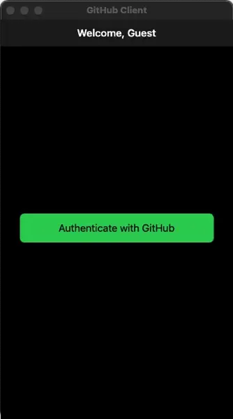
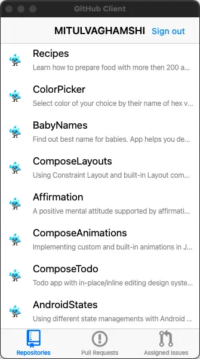

# GitHub Client

Flutter desktop app that accesses GitHub APIs to retrieve your repositories,
assigned issues, and pull requests. In accomplishing this task, you'll create
and use plugins to interact with native APIs and desktop applications, and use
code generation to build type safe client libraries for GitHub's APIs.
[Source][source]

Checkout original Google Codelab [Write a Flutter desktop application][codelab]
written by _@brettmorgan_.

## How to run the app

- [Register][register] an **OAuth2** app with `repo` and `read:org` scopes on GitHub.
- Copy **Client ID** and **Client Secret** from the OAuth2 app to `.env` file:

```env
CLIENT_ID=<client-id>
CLIENT_SECRET=<client-secret>
```

- **CAUTION:** _Do not commit `.env` file to VCS._
- Finally run the app as:

```sh
flutter run -d macos --dart-define-from-file=.env
```

## GitHub Public Schema

- https://docs.github.com/public/fpt/schema.docs.graphql

## Preview






[source]: https://codelabs.developers.google.com/codelabs/flutter-github-client#0:~:text=Flutter%20desktop%20app,for%20GitHub%27s%20APIs.
[codelab]: https://codelabs.developers.google.com/codelabs/flutter-github-client
[register]: https://codelabs.developers.google.com/codelabs/flutter-github-client#3
